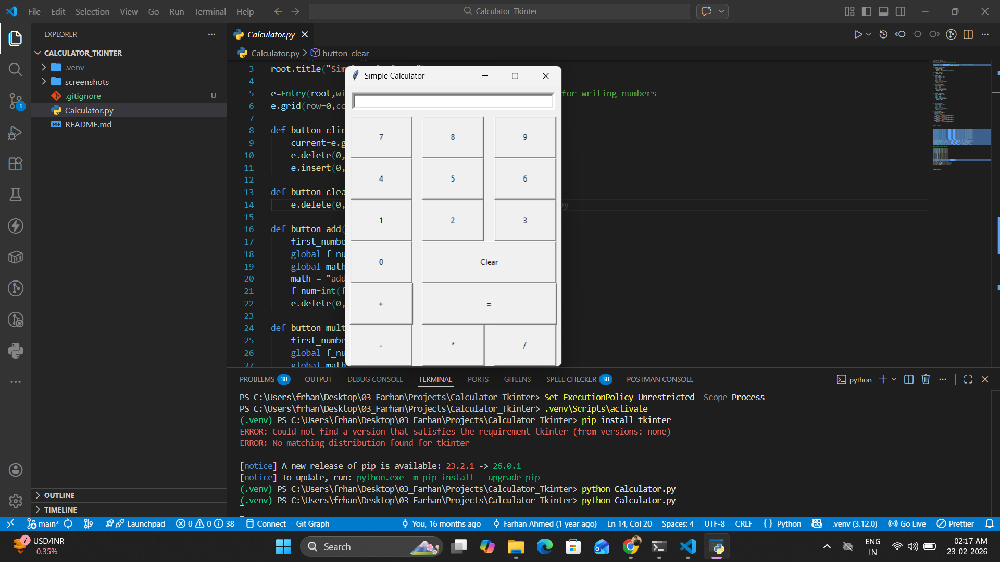

# 🧮 Calculator – Python Tkinter Desktop Application

A desktop-based GUI calculator application developed using **Python** and the **Tkinter library** to perform basic arithmetic operations.

This project demonstrates GUI development, event-driven programming, and fundamental application logic using Python.

---

## 🚀 Project Overview

The Calculator application provides a simple and interactive graphical interface that allows users to perform basic arithmetic operations efficiently.

The application supports:

- ➕ Addition
- ➖ Subtraction
- ✖ Multiplication
- ➗ Division
- 🧹 Clear functionality
- 🔢 Real-time input display

---

## 🛠 Tech Stack

### 🔹 Programming Language
- Python

### 🔹 GUI Framework
- Tkinter

---

## 🏗 Application Structure

User (GUI Interface)  
⬇  
Button Click Events  
⬇  
Arithmetic Logic  
⬇  
Display Output  

---

## ✨ Features

- ✅ Desktop-based GUI application
- ✅ User-friendly interface
- ✅ Interactive button-based input
- ✅ Real-time display updates
- ✅ Exception handling (e.g., division by zero)
- ✅ Lightweight and easy to run

---

## 🎯 Learning Outcomes

This project helped strengthen my understanding of:

- Python programming fundamentals
- Tkinter GUI development
- Event-driven programming
- Function handling and logic implementation
- Basic error handling techniques

---

## 📸 Screenshots

###  Home Page

---

## 👨‍💻 Author

**Farhan Ahmed**

- LinkedIn: https://www.linkedin.com/in/farhanahmedf21  
- GitHub: https://github.com/frhanahmed  
- Portfolio: https://frhanahmed.github.io/Portfolio/

---

## ⭐ If You Like This Project

Give it a star on GitHub ⭐  
It motivates me to build more practical and interactive applications!
